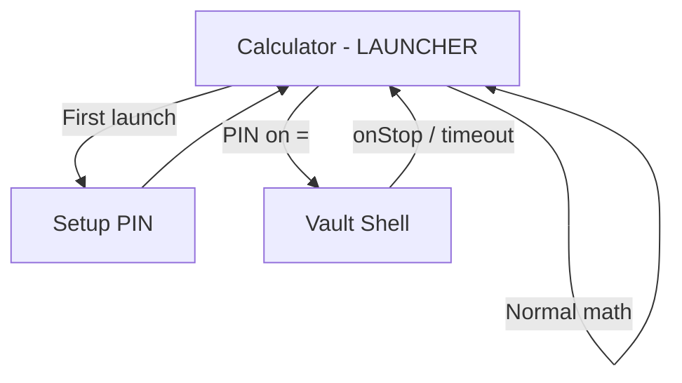
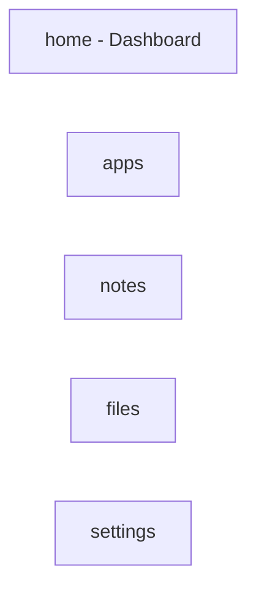

# Navigation Graph

## Top-Level Flow

## Routes

| Route | Screen | Access |
|-------|--------|--------|
| `calculator` | Calculator disguise | Always (entry) |
| `setup` | PIN setup wizard | Pre-setup only |
| `vault` | Authenticated shell | After valid PIN |

## Vault Bottom Navigation

| Route | Screen |
|-------|--------|
| `home` | Premium dashboard (greeting, security card, quick actions) |
| `apps` | Protected app shortcuts |
| `notes` | Secure notes list + search |
| `files` | File vault |
| `settings` | One UI grouped settings |

## Session Lock Behavior

- `MainActivity.onStop()` → `LockSessionUseCase`
- `MainActivity.onResume()` → expiry check → lock if expired
- Vault routes wrapped in `SecureScreenEffect` (FLAG_SECURE)

## Deep Links (Future)

- `privacyspace://notes/{id}`
- `privacyspace://files/preview/{id}`
